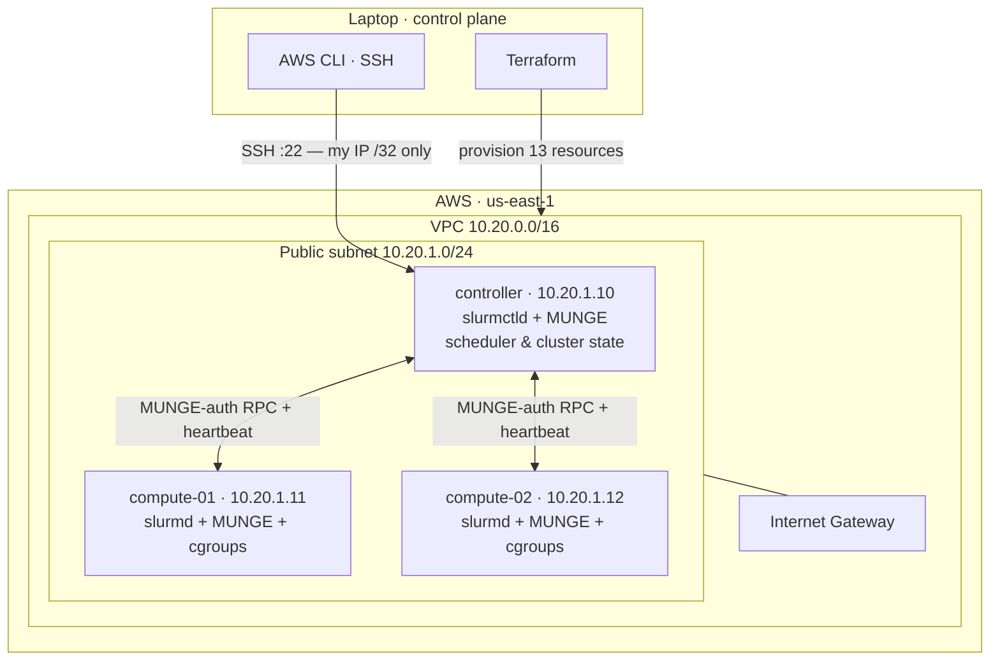
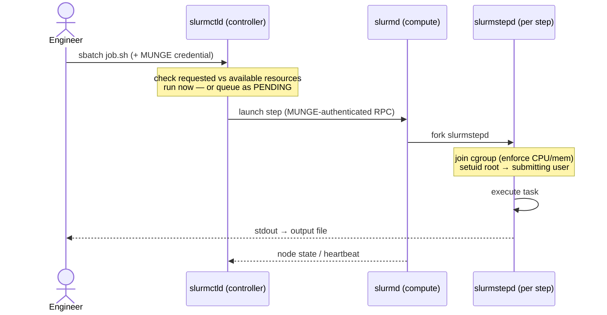

# Distributed Workload Platform — Mini EDA Compute Farm on AWS with SLURM

A **multi-node Linux compute cluster** built from scratch on AWS and driven by the **SLURM**
workload manager — provisioned with Terraform, secured with MUNGE, and isolated with cgroups.
The goal wasn't to copy a tutorial; it was to **build, operate, deliberately break, and recover**
a real batch-scheduling system the way an HPC / EDA infrastructure team runs a compute farm.

> **Scope:** an intentionally small, low-cost **learning cluster** (1 controller + 2 compute nodes).
> It favors visibility and hands-on failure drills over production HA/scale. Where a design choice
> differs from production, the README says so explicitly.

**Stack:** AWS (VPC/EC2) · Terraform · Ubuntu 24.04 · SLURM 23.11 · MUNGE · cgroups v2 · Bash

---

## Table of contents
- [What it does](#what-it-does)
- [Architecture](#architecture)
- [How a job is scheduled](#how-a-job-is-scheduled)
- [Reliability: health-check drain & recovery](#reliability-health-check-drain--recovery)
- [What I built & tested](#what-i-built--tested)
- [Notable engineering: debugging "PENDING (InvalidAccount)"](#notable-engineering-debugging-pending-invalidaccount)
- [Repository layout](#repository-layout)
- [Quickstart](#quickstart)
- [Operations](#operations)
- [Security & cost model](#security--cost-model)
- [Lab vs production](#lab-vs-production)

---

## What it does

- **Infrastructure as code** — one `terraform apply` builds the VPC, subnet, internet gateway,
  route table, a least-open security group, an SSH key pair, and three EC2 instances (13 resources).
- **Cluster authentication** — MUNGE gives every node a shared secret so SLURM RPCs are mutually
  trusted without a central auth server.
- **Batch scheduling** — CPU/memory-aware placement via `select/cons_tres`, with an `eda` partition.
- **Resource isolation** — cgroups enforce each job's CPU/memory allocation at the kernel level.
- **EDA-style workloads** — parameter sweeps (job arrays), multi-stage pipelines (job dependencies),
  and resource-contention scenarios that mirror simulation regressions and synth→timing→verify flows.
- **Node lifecycle & reliability** — manual drain/resume, daemon-failure detection and recovery, and
  an automated health check that drains a bad node so the scheduler routes around it.

---

## Architecture



| Component | Role |
|---|---|
| **controller** (`slurmctld`) | The brain. Owns all cluster state — node states, the job queue, allocations. Makes every scheduling decision. Runs as unprivileged `slurm`. |
| **compute nodes** (`slurmd`) | The workers. Register resources, launch job steps (via a per-step `slurmstepd`), enforce cgroup limits, heartbeat state back. Run as `root`. |
| **MUNGE** | Shared-key credential service. A credential minted on one node is verifiable on any other — this authenticates every SLURM RPC. |
| **cgroups v2** | Kernel-level enforcement of each job's CPU/memory allocation (the difference between *scheduling* and *isolation*). |
| **Terraform** | Declarative provisioning of all AWS infrastructure; reproducible and destroyable. |

---

## How a job is scheduled



`slurmd` is a lightweight, always-up daemon; it forks a **separate `slurmstepd` per job step** that
owns the cgroup, drops privileges, wires I/O, and reaps the task — so one misbehaving step can't take
down the node's other work.

---

## Reliability: health-check drain & recovery

Each node checks *itself* on a timer and drains itself when unhealthy — the controller is never a
polling bottleneck (this is what lets the pattern scale to thousands of nodes).


**Why recovery is manual:** auto-resuming on the first healthy check invites *flapping* — an
intermittently-bad node would drain → pass one check → resume → fail again. Draining is cheap to
automate; **returning a node to service is a trust decision** gated (in production) behind N
consecutive healthy checks, remediation, and sometimes human approval.

---

## What I built & tested

Every scenario below was run on the live cluster and its behavior observed and explained.

| Capability | Trigger | Observed result |
|---|---|---|
| Multi-node execution | `srun -N2 -n2 hostname` | task ran on **both** compute nodes |
| **Scheduling vs enforcement** | `srun --cpus-per-task=1 … nproc` | task sees **1** CPU (its *allocation*), not 2 (the *hardware*) — cgroup/affinity enforced |
| Resource contention | 3× `--exclusive` on 2 nodes | 2 `RUNNING`, 1 `PENDING (Resources)`; queued job **auto-starts** when a node frees |
| Job arrays (throughput control) | `--array=0-19%2` | 20 tasks throttled to 2 concurrent (`JobArrayTaskLimit`) — maps to EDA license limits |
| Dependency pipeline | `--dependency=afterok:` chain | synth → timing → verify run **strictly in order** even with idle nodes |
| Failure propagation | synth `exit 1` | downstream jobs → `DependencyNeverSatisfied`; pipeline halts (don't verify a failed synth) |
| Planned maintenance | `scontrol … State=DRAIN / RESUME` | new work avoids the node; **running jobs keep running** |
| Node failure | `systemctl stop slurmd` | node → `DOWN+NOT_RESPONDING` after `SlurmdTimeout`; **auto-recovers** on restart (`ReturnToService=2`) |
| Automated remediation | health check + injected fault | node **self-drains in ~30s**; controlled manual recovery |

---

## Notable engineering: debugging "PENDING (InvalidAccount)"

Batch jobs sat `PENDING` with reason `InvalidAccount` while nodes were `idle` — with account
enforcement *off* and no accounting database. Instead of guessing, I diagnosed by evidence:

1. `scontrol show config` → `AccountingStorageEnforce=none`, so enforcement wasn't the cause.
2. `journalctl -u slurmctld` → `_refresh_assoc_mgr_qos_list: no new list …` + `sched: JobId=N has invalid account`.
3. Reading the logs across submissions revealed the real behavior: on this distro build (no
   `slurmdbd`) the **main scheduler skips** jobs whose account can't be validated, but the
   **backfill scheduler places them ~10–30s later** — jobs were never stuck; my checks were just
   faster than the backfill cycle. Interactive `srun`/`salloc` were unaffected.
4. Fix for the lab: lean on backfill and tighten it (`SchedulerParameters=bf_interval=5`); the
   "proper" fix is `slurmdbd` with real accounts. (Also caught two invalid `slurm.conf` params along
   the way that crash `slurmctld` — `AccountingStorageEnforce=none` and `HealthCheckTimeout`.)

Takeaway: *"pending jobs with idle nodes"* is a classic ops ticket — root-caused here to the
main-vs-backfill scheduler split and an empty association manager, using logs rather than trial-and-error.

---

## Repository layout

```
.
├── infra/terraform/        # IaC: VPC, subnet, IGW, route table, SG, key pair, 3× EC2
│   ├── versions.tf         #   providers + pinning
│   ├── variables.tf        #   inputs (SSH CIDR has no default — must be set consciously)
│   ├── main.tf             #   all AWS resources + cloud-init (hostname + /etc/hosts)
│   ├── outputs.tf          #   public IPs + ready-to-paste SSH commands
│   └── terraform.tfvars.example
├── config/
│   ├── slurm.conf          # cluster identity, cons_tres, cgroups, partition, health check
│   └── cgroup.conf         # ConstrainCores / ConstrainRAMSpace
├── jobs/                   # EDA-style workloads
│   ├── hello.sbatch  exclusive.sbatch  sweep.sbatch   (basics, contention, array sweep)
│   └── synth.sbatch  timing.sbatch  verify.sbatch  synth_fail.sbatch   (dependency pipeline)
├── scripts/
│   ├── slurm-healthcheck.sh   # per-node self-check → auto-drain
│   └── update-ssh-ip.sh       # re-point the SSH security-group rule at your current IP
└── README.md
```

---

## Quickstart

**Prerequisites:** an AWS account + CLI credentials, Terraform ≥ 1.7, and an SSH key
(`ssh-keygen -t ed25519 -f ~/.ssh/slurm-lab`).

```bash
# 1. provision the infrastructure
cd infra/terraform
cp terraform.tfvars.example terraform.tfvars   # set allowed_ssh_cidr = "<your-ip>/32"
terraform init && terraform apply               # ~2 min; prints public IPs + SSH commands

# 2. on each node: install MUNGE, share one key, install SLURM, drop in config/*, start daemons
#    (controller: slurmctld+slurm-client · compute: slurmd+slurm-client)
#    then, from the controller:
sinfo                    # → two idle nodes in the 'eda' partition
srun -N2 -n2 hostname    # → runs on both compute nodes
```

---

## Operations

```bash
# SSH hangs / times out (your public IP changed — moved networks / ISP re-assigned):
./scripts/update-ssh-ip.sh          # detects current IP, updates only the SG rule

# Stop for the night (halts compute charges; keeps disks + all config):
aws ec2 stop-instances --instance-ids $(aws ec2 describe-instances \
  --filters "Name=tag:Project,Values=slurm-eda-lab" "Name=instance-state-name,Values=running" \
  --query "Reservations[].Instances[].InstanceId" --output text)

# Resume after a stop (private IPs are static, so the cluster still works; public IPs change):
aws ec2 start-instances --instance-ids $(aws ec2 describe-instances \
  --filters "Name=tag:Project,Values=slurm-eda-lab" "Name=instance-state-name,Values=stopped" \
  --query "Reservations[].Instances[].InstanceId" --output text)
cd infra/terraform && terraform refresh >/dev/null && terraform output && cd ..
./scripts/update-ssh-ip.sh

# Tear it all down ($0 after):
cd infra/terraform && terraform destroy
```

---

## Security & cost model

**Security**
- SSH is restricted to a **single `/32`** (your IP) — never `0.0.0.0/0`. Intra-cluster traffic is
  allowed only *between members of the security group*, not from any CIDR.
- IMDSv2 required (`http_tokens = "required"`); encrypted EBS.
- **Nothing sensitive is committed:** Terraform state, `terraform.tfvars` (your IP), SSH private
  keys, and `munge.key` are all git-ignored. The SSH *public* key is read from `~/.ssh` at apply
  time, never stored in the repo.

**Cost** — three `t3.micro` ≈ **$0.03/hr** total while running (a few cents per work session).
No NAT gateway, EFS/FSx, GPU, or multi-AZ. `terraform destroy` (or `stop`) when idle.

---

## Lab vs production

This cluster is deliberately minimal. A production EDA/HPC farm would add:

| Area | This lab | Production |
|---|---|---|
| Name resolution | `/etc/hosts` (3 lines) | DNS + IPAM + config management |
| Controller | single `slurmctld` | primary + backup `slurmctld`, durable state |
| Access | public IPs, SSH from my IP | private compute, bastion / SSM Session Manager |
| Accounting | none | `slurmdbd` + database (`sacct`, fair-share, chargeback) |
| Storage | node-local disk | shared FS (NFS/Lustre/GPFS/FSx) for tools + design data |
| Nodes | 2× identical `t3.micro` | heterogeneous CPU/high-mem/GPU partitions, at scale |
| Provisioning | Terraform + manual config | Terraform + Ansible/images, autoscaling, node lifecycle automation |
| Observability | `sinfo`/`squeue`/logs | Prometheus/Grafana, centralized logging, health dashboards |

Being able to draw that lab→production line — and explain *why each piece exists* — is the point of
the project.
