# Production-Scale Architecture

### Evolving a 3-node Slurm lab into a 100,000-machine EDA compute platform

> **What this document is.** The [`README`](../README.md) describes what I *actually built and tested* —
> a real 3-node Slurm cluster. **This** document is the *design evolution*: how that same system grows
> into a reliable, secure, observable, multi-site platform that schedules **EDA simulation and
> physical-design workloads across ~100,000 heterogeneous CPU/GPU machines for thousands of engineers
> running concurrently.**
>
> It is a **design + reasoning** document, not a claim that I ran 100k nodes. Everything is derived from
> first principles and from the mechanisms proven at small scale in the lab. It is written to be
> defended out loud, with explicit tradeoffs — the way a staff engineer reasons, not a feature list.
>
> Vendor-agnostic on purpose: the concepts (control planes, reconciliation, cells, remediation)
> apply whether the scheduler is Slurm, LSF, or something else.

---

## Contents

1. [The workload: what "EDA at scale" actually is](#1-the-workload-what-eda-at-scale-actually-is)
2. [Scale math: why 100k changes the rules](#2-scale-math-why-100k-changes-the-rules)
3. [The first-principles lens](#3-the-first-principles-lens)
4. [The platform at a glance (the plane model)](#4-the-platform-at-a-glance-the-plane-model)
5. [The spine: control loops & reconciliation](#5-the-spine-control-loops--reconciliation)
6. [Scheduler control plane: one → cells → federation](#6-scheduler-control-plane-one--cells--federation)
7. [Execution plane & the node lifecycle state machine](#7-execution-plane--the-node-lifecycle-state-machine)
8. [Fleet lifecycle controller (with a simulator)](#8-fleet-lifecycle-controller-with-a-simulator)
9. [Health & remediation pipeline](#9-health--remediation-pipeline)
10. [Zero-touch provisioning & config-as-code](#10-zero-touch-provisioning--config-as-code)
11. [Heterogeneous resources & topology](#11-heterogeneous-resources--topology)
12. [EDA specifics: phases, licenses, regressions](#12-eda-specifics-phases-licenses-regressions)
13. [Storage & the data plane](#13-storage--the-data-plane)
14. [Observability, SLOs & audit](#14-observability-slos--audit)
15. [Failure domains, multi-site & disaster recovery](#15-failure-domains-multi-site--disaster-recovery)
16. [Security & identity at scale](#16-security--identity-at-scale)
17. [Capacity, utilization, fairness & backpressure](#17-capacity-utilization-fairness--backpressure)
18. [Validating the design without 100k machines](#18-validating-the-design-without-100k-machines)
19. [Quality attributes → mechanisms](#19-quality-attributes--mechanisms)
20. [Key design decisions & tradeoffs](#20-key-design-decisions--tradeoffs)
21. [Evolution roadmap (mapped to the lab)](#21-evolution-roadmap-mapped-to-the-lab)
22. [How to reason about any fleet problem](#22-how-to-reason-about-any-fleet-problem)

---

## 1. The workload: what "EDA at scale" actually is

Design decisions are downstream of workload shape, so start here. A large chip-design compute farm
serves a mix of **phases**, each with a different resource profile:

| Phase | Shape | Dominant resource | Duration | Scale pattern |
|---|---|---|---|---|
| RTL simulation / regressions | many independent runs (seeds, testcases, corners) | CPU throughput, some RAM | seconds–hours | **huge job arrays** (10⁴–10⁶ tasks) |
| Synthesis | one big job per block | **high memory**, single-node | hours | many concurrent, memory-bound |
| Place & route (P&R) | one very large job per block | **very high memory**, long, checkpointed | hours–days | few but expensive, long-lived |
| Static timing (STA) | per-corner analysis | high memory | hours | fan-out over corners |
| DRC / LVS (physical verification) | large, I/O + memory heavy | memory + **storage bandwidth** | hours | bursty |
| ML / GPU workloads (e.g. ML-driven optimization, GPU-accelerated sim) | GPU | **GPU + fast interconnect** | hours | growing share |

Cross-cutting truths that dominate the architecture:

- **Licenses are often the binding constraint, not compute.** A tool may have 500 floating licenses
  while 50,000 tasks are queued. CPUs sit idle waiting for a *license token*.
- **Jobs are long and expensive.** A 10-hour P&R job that dies at hour 9 because a DIMM threw an
  uncorrectable error is a very costly failure → checkpointing, requeue policy, and *not evicting
  healthy work* matter enormously.
- **Shared design data is enormous.** Toolchains, PDKs, and design databases live on shared storage;
  "fast CPUs don't help if every job is blocked on the filesystem."
- **Thousands of humans submit concurrently**, with bursty regressions that fan out to millions of
  tasks in seconds. The *submission and queue path* must absorb bursts without melting the controller.

**Talking point:** *"I design the platform around the workload: EDA is a mix of massive CPU-throughput
regressions, memory-bound long-lived P&R jobs, and license-gated tool runs over huge shared data. That
mix — not raw node count — dictates the scheduling, storage, and reliability design."*

---

## 2. Scale math: why 100k changes the rules

The jump from 3 nodes to 100,000 isn't quantitative, it's qualitative — several things that were
"never happens" become "happening right now, continuously."

| Concern | 3-node lab | ~100,000 nodes |
|---|---|---|
| **Hardware faults** | effectively never | **continuous**. Even at a modest 5%/yr annualized failure rate that's ~14 node-affecting events **per day**; GPUs (Xid errors, thermal, ECC) push it higher. Assume **0.1–1% of the fleet is unhealthy at any instant = 100–1,000 nodes down right now.** |
| Human effort | one person SSHes | on-call **cannot** scale linearly with nodes → **toil reduction is survival**, remediation must be autonomous |
| Name resolution | `/etc/hosts` | DNS + IPAM + service discovery |
| Config delivery | `scp` one file | config-as-code + validation + **staged rollout** (a bad config pushed to 100k nodes at once is an outage) |
| Scheduler | one `slurmctld` | **federated cells**, each with HA + accounting DB; one control plane can't own 100k nodes + burst submission |
| Failure blast radius | one node | node → rack → row → AZ → datacenter → region; design must **contain** each |
| State truth | look at `sinfo` | an **inventory/reconciliation system** is the source of truth; `sinfo` is one input |

The core inversion: **at 3 nodes the interesting question is "does it work?"; at 100k the interesting
question is "what happens when 1,000 of them are broken, a config push is halfway rolled out, and a
regression just queued 2 million tasks — and can the platform keep serving useful work?"**

---

## 3. The first-principles lens

Every section below is answered through the same 11 questions. This is the reasoning framework —
memorize the questions, not the answers:

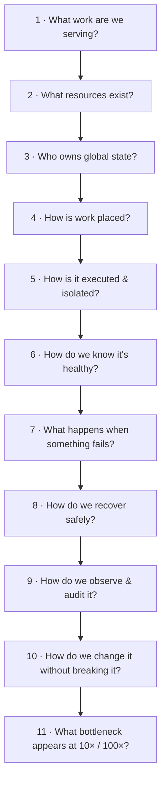

---

## 4. The platform at a glance (the plane model)

The whole system is a set of **planes**, each with one job and one kind of state. Separating them is
what makes the platform reason-about-able and independently scalable. Read this top-to-bottom as the
flow of a job and the flow of control:

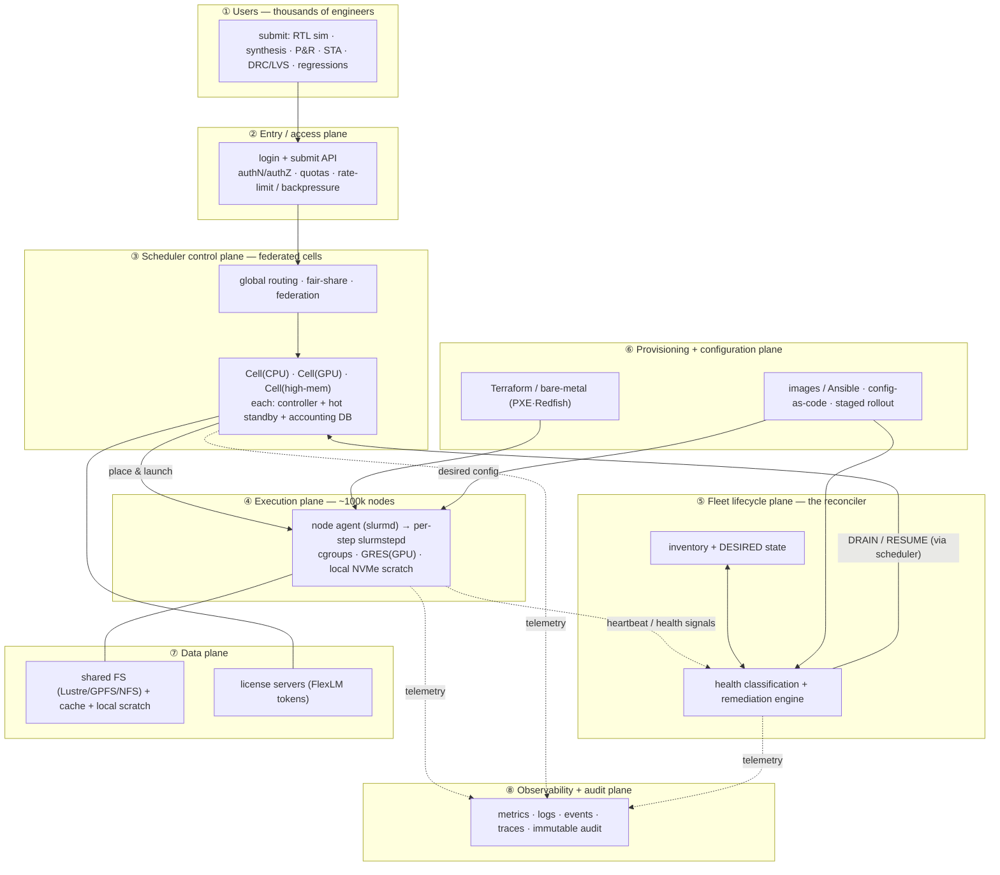

| Plane | Single responsibility | State it owns | Scale concern at 100k |
|---|---|---|---|
| ② Access | authenticate, admit, throttle | sessions, quotas | burst submission; must shed load, not fall over |
| ③ Scheduler | decide *where* work runs | queue, allocations, node states | one controller can't own 100k → **cells + federation**; HA |
| ④ Execution | run & isolate the work | per-node running steps | node-local only → fails independently (good) |
| ⑤ Lifecycle | keep the fleet in its desired state | inventory, desired vs actual | reconcile rate; avoid remediation storms |
| ⑥ Prov/Config | make nodes exist & be correct | infra state, config versions | a bad push is a fleet-wide outage → staged rollout |
| ⑦ Data | serve tools/design data/licenses | files, tokens | metadata storms, throughput, license starvation |
| ⑧ Observability | explain the system | metrics/logs/events/audit | cardinality; don't let telemetry outgrow the fleet |

**Talking point:** *"I don't think of it as 'a big Slurm cluster'. I think of it as planes with clean
seams — scheduling, execution, lifecycle, config, data, observability — each owning one kind of state
and scaling independently. The scheduler decides *where*; a separate lifecycle control plane keeps the
*fleet itself* in a desired state. Conflating those two is how you get a system nobody can operate."*

---

## 5. The spine: control loops & reconciliation

The single most important idea in the whole platform. Every autonomous behavior — provisioning,
config, health, capacity — is the **same control loop**: declare a desired state, observe actual
state, compute the diff, take the smallest action to converge, verify, repeat.

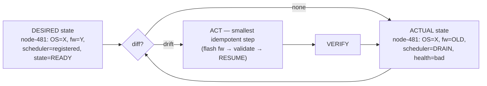

Why this framing matters:

- **Idempotency is non-negotiable.** `drain(node)`, `repair(node)`, `apply_config(node)` must be safe
  to run repeatedly — a retried action can't corrupt state. This is what lets you crash and restart the
  controller, or run it in multiple replicas, without fear.
- **Convergence over imperative scripts.** "Restart the bad server" is a one-shot; a reconciler
  *continuously drives* the fleet toward desired state and self-heals drift. It's the difference
  between a cron job and Kubernetes/Terraform-style control.
- **The controller is stateless-ish about actions, authoritative about intent.** Desired state lives in
  version control / inventory; actual state is observed; the loop is the bridge.

**Talking point:** *"I'd model fleet management as reconciliation, not automation scripts. Desired state
is declared and version-controlled; a control loop observes actual state, diffs, and takes the smallest
idempotent action to converge, then verifies. That's why it survives controller restarts and scales:
adding nodes adds objects to reconcile, not new bespoke scripts."*

---

## 6. Scheduler control plane: one → cells → federation

**Problem:** a single scheduler controller (`slurmctld`, or an LSF master) has finite limits — RPC
throughput, scheduling-cycle time, memory for job/node objects, and a single failure domain. It
comfortably handles thousands of nodes and high job churn, but **not** 100k nodes plus millions of
queued array tasks plus thousands of concurrent submitters.

**Design:** partition the fleet into **cells** (independent scheduler instances), each owning a few
thousand to ~10k nodes, fronted by a **federation / routing layer** that presents one logical service
and enforces global fair-share and quotas. Cells are also a natural **capability boundary** (CPU / GPU
/ high-mem) and a **failure-isolation boundary** (a cell outage ≠ a fleet outage).

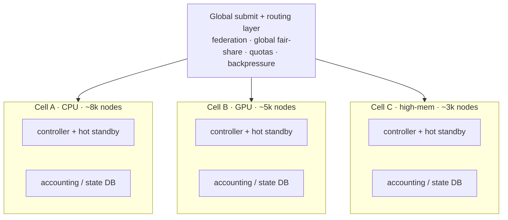

**Controller HA (per cell):** primary + backup controller sharing **durable state** (in the lab this is
`StateSaveLocation` on local disk; at scale it's replicated/shared storage). On primary loss the backup
takes over; running jobs keep running (the execution plane is independent of the controller — proven in
the lab: killing `slurmctld` didn't kill running work). **Tested failover** is the deliverable, not just
"we have a backup."

**Backpressure:** the submit path must protect the controllers. A regression that fans out to 2M tasks
should be admitted as a bounded array with a concurrency cap, not 2M individual RPCs. Rate-limit at the
access plane; reject/queue with clear feedback rather than collapsing.

| Choice | Pros | Cons | When |
|---|---|---|---|
| One giant cluster | simplest, global view, best packing | single failure domain, RPC/cycle limits, blast radius | small/medium fleets |
| Many cells + federation | isolation, horizontal scale, capability boundaries | cross-cell fairness is harder, more moving parts, routing logic | large heterogeneous fleets |
| Fully independent clusters | maximum isolation | no global view, manual balancing, fragmented capacity | multi-org / strict isolation |

**What breaks at the next 10×:** the *federation layer* and the *accounting DB* become the new
bottlenecks; global fair-share across cells and cross-cell job routing get expensive. You then shard
accounting and make fair-share hierarchical.

**Talking point:** *"A single controller is a scaling and failure-domain limit, so past a few thousand
nodes I'd federate into cells — also aligning cells with capability classes and blast-radius boundaries
— behind a routing layer that owns global fair-share. Each cell runs primary+standby with durable state
and tested failover. The execution plane is deliberately independent of the controller so a control-plane
failover doesn't kill running jobs."*

---

## 7. Execution plane & the node lifecycle state machine

The execution plane is intentionally **dumb and independent**: each node runs the agent (`slurmd`),
which forks a per-step `slurmstepd` that joins the cgroup, drops privileges to the user, binds GRES
(GPUs), and runs the task. A node failing takes only its own work with it — never the fleet.

But at scale, a node is not "up or down" — it moves through a **lifecycle**, and the lifecycle plane
(next section) is what drives it:

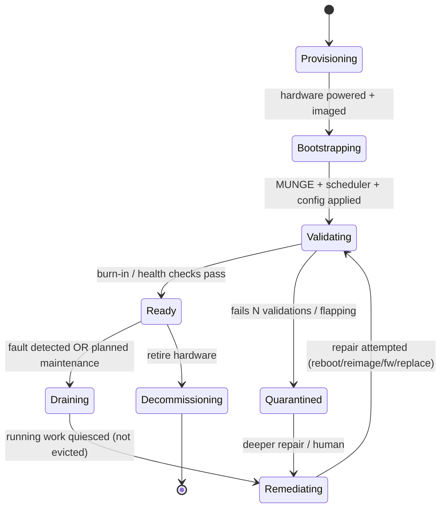

Key distinctions that the lab made concrete:

- **`DRAIN` ≠ `DOWN`.** DRAIN = healthy but no new work (running jobs continue); DOWN = the controller
  lost the node (detected via missed heartbeat after `SlurmdTimeout`). At scale you tune that timeout
  as a real tradeoff: too short → transient network blips falsely DOWN thousands of nodes; too long →
  slow detection.
- **`DRAIN` ≠ repair.** Draining controls *scheduling*; it doesn't heal hardware. Whether running jobs
  survive depends on *why* you drained (planned maintenance → they finish; dead DIMM → they may die).
- **Return-to-service is a trust decision, not automatic** (see §9).

---

## 8. Fleet lifecycle controller (with a simulator)

This is the component that turns "I know Slurm" into "I can design the platform *around* a scheduler."
It is a reconciler (from §5) specialized to node lifecycle. Suggested shape:

```text
fleet-controller/
├── api/            # desired-state intake, operator actions, status
├── inventory/      # source of truth: identity, HW type, fw, OS, cell, state, health
├── lifecycle/      # the state machine + transitions (idempotent)
├── health/         # signal ingestion + fault classification
├── remediation/    # policy → actions (reboot/reimage/fw/replace), retry/backoff/quarantine
├── scheduler/      # ADAPTER: talk to Slurm/LSF (drain, resume, node state)
├── simulator/      # in-memory fleet for high-cardinality testing
└── observability/  # metrics, events, audit emission
```

The decisive design move is a **scheduler adapter interface** with two implementations — the same
policy and state-machine code drives both:

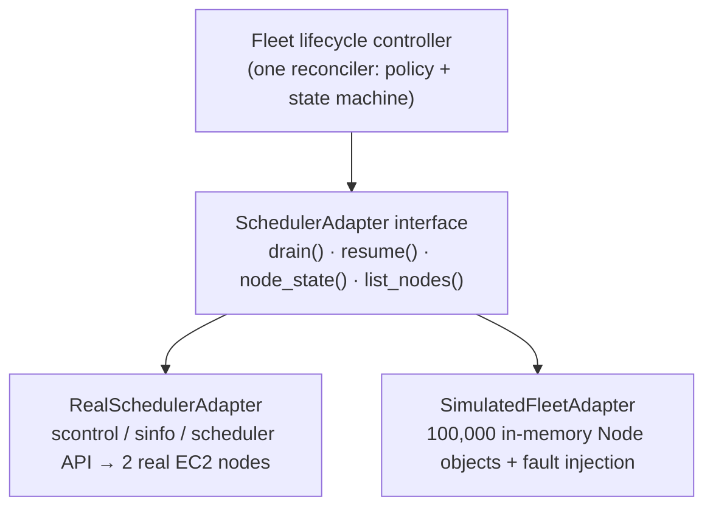

Why this is powerful: the *integration* is validated against a real cluster (small), while the
*control-plane behavior* (idempotency, batching, backpressure, remediation dedup) is validated against
a simulated 100k-node fleet. You never claim a 2-node EC2 box proved physical scale — you prove the
*architecture* doesn't depend on node count. (See §18 for what to measure.)

**Talking point:** *"I'd separate the lifecycle controller from its scheduler adapter. That gives me a
real integration path against a small cluster and an in-memory fleet backend for high-cardinality
testing — so I can exercise thousands of node states and fault events for idempotency, batching, and
remediation storms without pretending a two-node deployment demonstrated 100k-node scale."*

---

## 9. Health & remediation pipeline

The reliability core. The essential design principle: **separate detection from classification from
policy from remediation from validation.** Coupling them is how one bad rule drains the whole fleet.

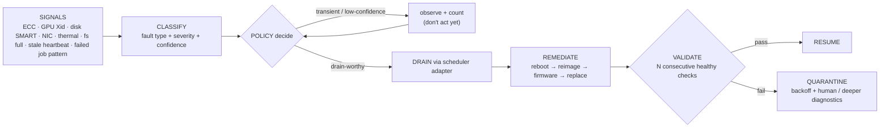

Design rules that matter at scale:

- **Detection ≠ action.** A signal increments state; *policy* decides. This lets you change policy
  (thresholds, which faults auto-remediate) without touching detectors, and lets you **dry-run** a new
  policy against history before enabling it.
- **Retry with backoff, then quarantine — never a flap loop.** The lab already refuses auto-RESUME on
  the first healthy check to avoid `bad→drain→resume→bad`. At scale: `fail → retry → backoff → after K
  failures → QUARANTINE` for human/deeper diagnostics.
- **Blast-radius guards on remediation itself.** A rule that would drain >X% of a cell, or >Y nodes/min,
  must **trip a circuit breaker** and page a human instead of executing. *"One broken health rule must
  not be able to drain 10,000 healthy nodes"* is a first-class requirement.
- **Fault taxonomy drives policy.** ECC single-bit (log, watch) vs uncorrectable (drain now); GPU Xid
  classes (some retryable, some = RMA); disk SMART (drain, migrate scratch); thermal (drain, check
  cooling). Different classes → different remediations and different auto/human thresholds.

**Talking point:** *"Draining is cheap to automate; returning to service is a trust decision. I gate
resume behind N consecutive healthy checks plus remediation completion, use backoff-then-quarantine to
kill flapping, and put a circuit breaker on the remediation engine so a single bad rule can't drain the
fleet. Detection, policy, and action are separate services so policy can be dry-run against history."*

---

## 10. Zero-touch provisioning & config-as-code

**Goal:** rebuild the entire platform from zero with no human SSH — the honest V2 of the lab (where
MUNGE/Slurm were configured by hand *so I'd understand every moving part*).

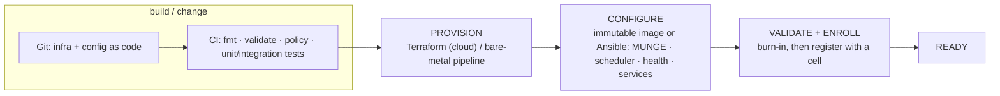

Two sub-designs matter:

**(a) Safe rollout — never change 100k nodes at once.** A bad config pushed everywhere simultaneously is
a self-inflicted outage. Gate every change:

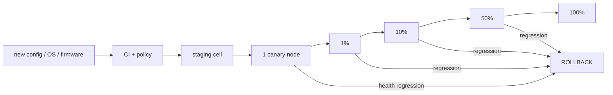

Each gate watches health/SLO signals; a regression auto-rolls-back. **Drift reconciliation** runs
continuously (§5) so a node that falls out of desired config is detected and corrected.

**(b) Bare-metal lifecycle** (cloud hides this; a real EDA fleet is largely bare metal):

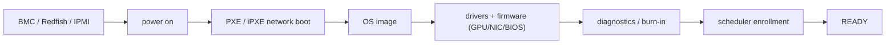

**Tradeoff — immutable images vs config management:** images give reproducibility and fast, identical
rebuilds (bake once, boot many) but slower iteration; Ansible-style CM is flexible and fast to change
but risks drift and slower convergence. Mature fleets use **images for the base + CM for the last mile**,
with drift reconciliation catching the gaps.

**Talking point:** *"Terraform owns provisioning; images/Ansible own configuration; both are behind
Git + CI. I never push to the whole fleet — changes flow staging → canary → 1/10/50/100% with health
gates and automatic rollback, and a reconciler continuously corrects drift. Rebuild-from-zero is a
tested capability, not a runbook."*

---

## 11. Heterogeneous resources & topology

At scale, "a node" is many different things, and the scheduler must model that precisely or it will
place work badly.

- **Resource classes:** CPU generation/microarch (AVX-512?), RAM tiers (256 GB vs 2 TB for P&R),
  **GPU type/count** (modeled as GRES; sets `CUDA_VISIBLE_DEVICES`), local NVMe scratch size, network
  fabric (Ethernet vs low-latency interconnect).
- **Features & constraints:** nodes advertise `Feature`s; jobs request `--constraint=` / `--gres=gpu:N`
  / `--mem=`. This is the lab's `Feature`/`constraint` idea at fleet scale.
- **Topology-aware placement:** NUMA locality, GPU-GPU interconnect topology, and rack/switch locality
  for multi-node jobs — placing a tightly-coupled job across a slow link wastes the allocation.
- **Cells as capability pools** (§6) keep like-with-like and simplify fair-share and reporting.

**What breaks at the next 10×:** heterogeneity explosion (many GPU generations, mixed fabrics) makes
scheduling and capacity accounting combinatorial → you invest in accurate inventory and topology data
as first-class scheduler inputs.

---

## 12. EDA specifics: phases, licenses, regressions

Where a generic HPC platform and an *EDA* platform diverge.

**License-aware scheduling (the defining EDA constraint).** Tool licenses (FlexLM/FlexNet) are a scarce,
*schedulable* resource independent of CPU/RAM:

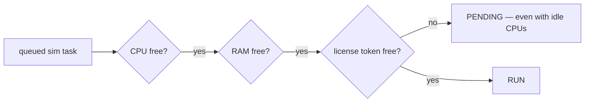

The scheduler must treat licenses as a resource (Slurm `Licenses=`, or an external license-aware
scheduler) so it doesn't dispatch work that immediately blocks on a token, and so it avoids **license
starvation** (one team draining the pool). Backfill must be license-aware. **Talking point:** *"On an
EDA farm the binding constraint is frequently the license pool, not the cluster — I schedule licenses as
a first-class resource and reason about token fairness, not just CPU fairness."*

**Regressions = throughput control.** A verification regression is a massive job array; the array
concurrency cap (`--array=…%N`, proven in the lab) is bounded throughput — *analogous to* (not the same
mechanism as) a license limit or a storage-bandwidth budget. At scale you also add fair-share and QoS so
one regression can't monopolize a cell.

**Long, checkpointed jobs.** P&R/STA run for hours–days; the platform's job is to (a) not evict them on
a *planned* drain, (b) support checkpoint/requeue so a node fault doesn't cost a day, and (c) prioritize
their placement on stable, high-memory nodes.

---

## 13. Storage & the data plane

"Fast CPUs don't help if every job is blocked on the filesystem." Storage is often the real scaling
wall on an EDA farm.

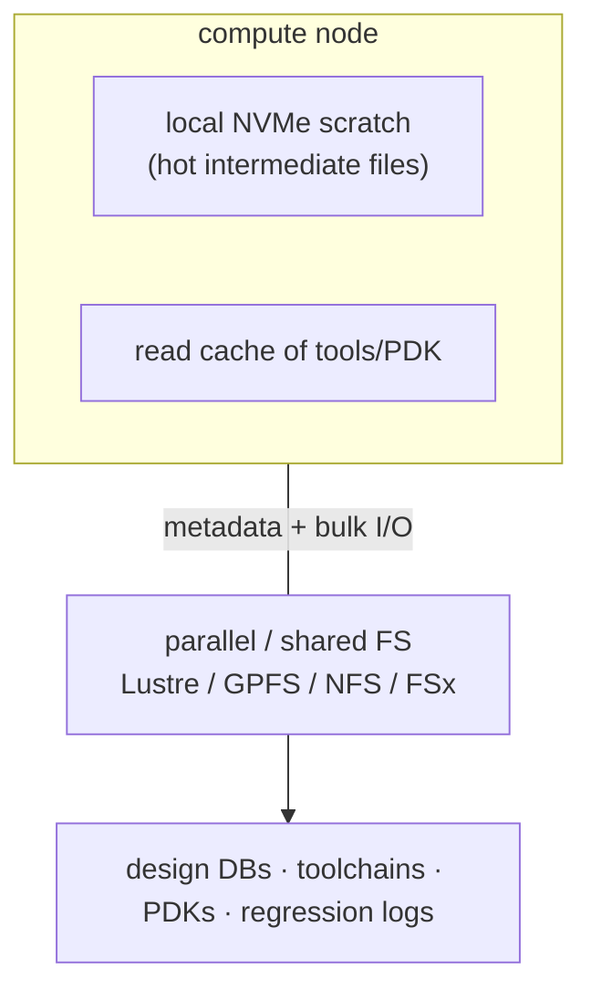

Design concerns a staff engineer raises:

- **Metadata storms & small files.** EDA runs create millions of tiny files; metadata ops (not
  bandwidth) become the bottleneck → parallel FS with strong metadata, and push hot/intermediate I/O to
  **local scratch**, not the shared FS.
- **Throughput vs IOPS vs metadata** are different limits; know which one you're hitting before buying
  more storage.
- **Caching** of read-mostly tools/PDKs near compute cuts shared-FS load dramatically.
- **Blast radius:** a shared FS is a huge failure domain — if it degrades, *every* job stalls. Isolate
  by cell/site, and treat "slow NFS" as a first-class fault to detect (it looks like slow jobs, not a
  down node).
- The lab made this concrete: with **no** shared FS, a batch job's output stranded on the executing
  node — the visceral lesson that shared storage is why outputs/tools/data are visible fleet-wide.

---

## 14. Observability, SLOs & audit

You cannot operate what you cannot explain. Four signal types, then SLOs on top.

- **Metrics** — golden signals *for a compute farm*: queue wait time, scheduler cycle time, cluster
  utilization (allocated vs idle CPU/GPU), job failure rate, **MTTD / MTTR**, drain reasons, remediation
  success rate, node recovery rate, license utilization/wait, storage latency.
- **Logs** — controller, node agents, remediation.
- **Events** — state transitions (DRAIN/RESUME/QUARANTINE), rollouts, failovers.
- **Traces** — a job's path: submit → schedule → node → step → outcome.
- **Audit (immutable)** — who changed what config/node and why.

**SLOs + error budgets** turn reliability into a managed quantity, e.g. *"95% of interactive submits
scheduled within N seconds,"* *"fleet utilization ≥ X%,"* *"MTTR for auto-remediable faults < M
minutes."* Breach burns error budget → freeze risky rollouts.

**Traceability example** — the system should be able to reconstruct this timeline for any node:

```text
14:31  health: ECC uncorrectable on node-4821
14:31  lifecycle: classified DRAIN-worthy (confidence high)
14:31  scheduler: node-4821 → DRAIN (running job 88123 left running)
14:32  remediation #839: reboot initiated
14:34  diagnostics: memtest pass
14:35  validation 1/3 healthy
14:37  validation 3/3 healthy
14:37  scheduler: node-4821 → RESUME
```

**Talking point:** *"Automation without observability is just faster ways to break. I'd instrument the
golden signals for a farm — queue wait, utilization, MTTD/MTTR, remediation success, license wait — put
SLOs with error budgets on the ones users feel, and keep an immutable audit trail so every job → node →
fault → remediation is reconstructable. That makes the platform explainable, not just automated."*

---

## 15. Failure domains, multi-site & disaster recovery

Think in *domains*, not nodes. Each level is a blast radius to contain:

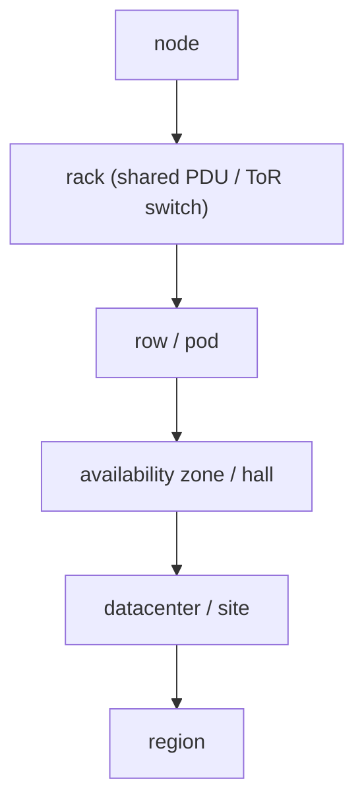

For each: *how many jobs die if this disappears, and does the control plane survive?* Design so a rack
loss drains a rack's worth of capacity (not a cell), a cell loss is isolated by federation, and a **site
loss** has a defined answer.

**Multi-site / DR questions the doc must answer:** if site A is down, where does work go? What
**data/license/config dependencies** pin a job to a site (design DB locality, license server location,
PDK availability)? Is the scheduler control plane per-site with global federation, or global with
regional cells? What's the RPO/RTO for the accounting DB and inventory? DR isn't "we have backups" —
it's *tested* failover of control planes and a known capacity-degradation story.

---

## 16. Security & identity at scale

The lab's honest shortcuts (public IPs, SSH from one IP, hand-copied MUNGE key) invert in production:

- **Network:** compute/controllers have **no public exposure**; access is via bastion / VPN / SSM-style
  brokered sessions. (The lab's `/32` SSH rule is the toy version of this — and it's now enforced in
  code via Terraform validation, not a comment.)
- **Identity:** central identity (LDAP/AD/SSO); least-privilege roles for operators and services; no
  shared admin.
- **Secrets:** the MUNGE key and tool credentials come from a **managed secret store** with rotation,
  access control, and auditing — never `scp`'d by hand. Image signing and provenance for what boots.
- **Policy-as-code:** security/compliance gates in CI (no `0.0.0.0/0`, required encryption, tagging).
- **Auditability:** every privileged action is attributable.

**Talking point:** *"At scale I'd remove humans from the trust path: private networking with brokered
access, central identity with least privilege, secrets (MUNGE, tool licenses) from a rotating managed
store with audit, and security policy enforced in CI. The lab's single-/32 SSH rule and hand-distributed
key are deliberately the throwaway versions of exactly these controls."*

---

## 17. Capacity, utilization, fairness & backpressure

When the queue is deep, the naive answer is "buy more machines." The staff answer is **diagnose the
binding constraint first:**

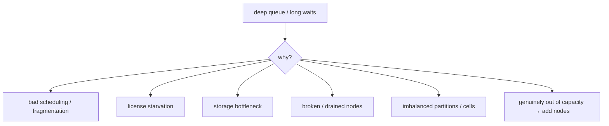

- **Utilization vs fairness tension:** backfill maximizes utilization; fair-share/quotas/preemption keep
  one team from monopolizing capacity. These pull against each other — the policy is a deliberate choice.
- **Backpressure:** when demand exceeds control-plane or fleet capacity, the system must **degrade
  gracefully** (throttle admission, queue with honest feedback) rather than collapse.
- **Fragmentation:** many small jobs can strand large-job capacity; topology/packing policy matters.

**Talking point:** *"'We need more machines' is a hypothesis, not a conclusion. I'd first attribute
queue pressure to scheduling, fragmentation, licenses, storage, or broken capacity — often the fix is
policy or a storage/license bottleneck, not hardware. And I design admission with backpressure so
overload degrades service instead of taking down the control plane."*

---

## 18. Validating the design without 100k machines

The credible answer to *"you only had two workers — how do you know it scales?"* is the
adapter split from §8: real integration at small scale, control-plane behavior at simulated scale.

**Inject into the simulated fleet:**

```text
- 500 simultaneous node failures        - a rack / AZ outage
- 100 flaky (intermittently-bad) nodes  - 10% firmware drift
- a burst of 100,000 queued tasks        - a health-event storm
- controller restart mid-reconcile      - degraded/slow shared storage
```

**Measure (these are the real scalability questions):**

- Reconcile **throughput** (nodes/sec) and whether it stays linear as fleet size grows.
- Controller **memory** vs fleet size (linear? bounded?).
- **Remediation dedup:** does one fault generate *one* action or 50 duplicates?
- **Retry storms:** do backoff/circuit-breakers actually prevent thundering herds?
- **Backpressure:** does admission shed load under a task burst instead of collapsing?
- **Safety:** can a single bad rule drain >X% — and does the circuit breaker stop it?

**Talking point (verbatim-ready):** *"I separated the lifecycle controller from its scheduler adapter.
The integration is exercised against a real Slurm cluster, but I also built an in-memory fleet backend to
generate thousands of node states and fault events — so I could test idempotency, batching, backpressure,
and remediation storms without pretending a two-node deployment demonstrated physical 100k-node scale. At
real scale I'd then validate scheduler-, network-, and storage-specific behavior against progressively
larger staging cells."*

---

## 19. Quality attributes → mechanisms

The properties that make it *production-grade*, each tied to a concrete mechanism in this design:

| Quality | First-principles question | Mechanism here |
|---|---|---|
| Reliability | keeps serving when components fail? | independent execution plane; cell isolation; controller HA |
| Availability | users can still submit/run despite failures? | HA controllers; federation; graceful degradation |
| Scalability | ops grows sublinearly with nodes? | reconciliation (objects, not scripts); cells; automated remediation |
| Fault isolation | one broken node/rack/cell contained? | failure domains (§15); cells; remediation circuit breakers |
| Recoverability | unhealthy capacity returns safely? | drain→remediate→validate→resume; quarantine |
| Observability | can we tell *why* it's slow/unhealthy? | golden-signal metrics, events, traces, audit |
| Operability | can on-call control it at 3 AM? | clear planes, dashboards, safe operator actions, runbooks |
| Auditability | who changed what & why? | immutable audit log; config-as-code history |
| Traceability | reconstruct job→node→fault→fix? | correlated events + traces (§14 timeline) |
| Security | identities/secrets/networks minimized? | private net, central identity, secret store, policy-as-code |
| Reproducibility | rebuild the same env consistently? | Terraform + images + config-as-code |
| Idempotency | operations safe to retry? | reconciler actions idempotent by construction |
| Consistency | all nodes running intended config? | drift reconciliation |
| Performance | control-plane latency predictable? | cells; backpressure; scheduler tuning |
| Utilization | expensive CPU/GPU actually used? | backfill; capacity attribution; topology packing |
| Fairness | one tenant can't monopolize? | fair-share, quotas, QoS, preemption |
| Backpressure | overload handled gracefully? | admission throttling; bounded arrays |
| Safe evolution | update without destroying the farm? | staged rollout + auto-rollback |
| Testability | validate failures/upgrades first? | staging cells; simulator + fault injection |
| Disaster recovery | controller/site/storage loss? | tested failover; multi-site; RPO/RTO on state |
| Cost efficiency | sized/operated economically? | utilization + capacity engineering; right-sizing |
| **Toil reduction** | fleet grows without proportional humans? | autonomous reconcile + remediation; the whole point |

---

## 20. Key design decisions & tradeoffs

The decisions a reviewer will push on — with the alternative and the reasoning:

| Decision | Alternatives | Why / tradeoff |
|---|---|---|
| Federated cells | one giant cluster | isolation + horizontal scale vs harder global fairness. Chosen past a few-thousand nodes. |
| Separate lifecycle plane from scheduler | bolt health into the scheduler | clean seams, independent scaling, testable via adapter; costs an extra system to run |
| Reconciliation loops | imperative remediation scripts | self-healing + idempotent + survives restarts vs more upfront design |
| Drain-worthy auto, resume manual/gated | auto-resume on first healthy | prevents flapping vs slightly slower recovery. Correct default. |
| Immutable image base + CM last mile | pure CM, or pure images | reproducibility + flexibility balance; drift reconciliation covers the seam |
| Staged rollout + auto-rollback | push everywhere | avoids fleet-wide self-outage vs slower change propagation |
| Licenses as a first-class scheduled resource | schedule only CPU/RAM | avoids dispatching work that instantly blocks; models the real EDA constraint |
| Local scratch + cache, shared FS for durable data | everything on shared FS | avoids metadata storms / shared-FS blast radius vs data-placement complexity |
| Adapter + simulator for scale testing | test only on real hardware | validates control-plane scale honestly without owning 100k nodes |
| `SlurmdTimeout` / detection thresholds tuned | defaults | false-DOWN storms vs detection latency — an explicit, owned tradeoff |

---

## 21. Evolution roadmap (mapped to the lab)

What the [`README`](../README.md) already proves, and the ordered path from here. **Depth over
breadth — do the first three well before anything else.**

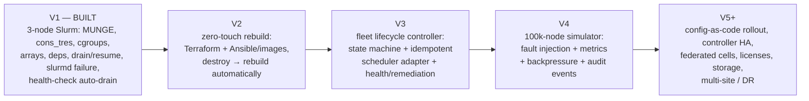

| Stage | Deliverable | Proves |
|---|---|---|
| **V1 (built)** | real 3-node cluster, failure drills | "I understand how the scheduler behaves" |
| V2 | one command rebuilds the cluster from zero | reproducibility, config-as-code, no-SSH ops |
| V3 | Python reconciler + state machine + adapter | policy/infra separation, idempotency, control loops |
| V4 | simulate 100k nodes + inject faults + metrics | the architecture scales independent of node count |
| V5+ | HA, cells, licenses, storage, multi-site, DR | full platform reasoning |

---

## 22. How to reason about any fleet problem

The payoff. Given *any* infrastructure/scheduling question, walk the lens from §3 and you sound like a
staff engineer instead of reciting commands:

```text
1  What work are we serving?          → workload shape drives everything (§1)
2  What resources exist?              → heterogeneous, license-gated (§11, §12)
3  Who owns global state?             → scheduler cells + inventory (§3, §6)
4  How is work placed?                → cons_tres, constraints, topology, licenses (§11–12)
5  How is it executed & isolated?     → slurmd → slurmstepd → cgroups (§7)
6  How do we know it's healthy?       → local health checks + signals (§9)
7  What happens when it fails?        → DRAIN ≠ DOWN ≠ repair; blast radius (§7, §15)
8  How do we recover safely?          → drain→remediate→validate→resume; quarantine (§9)
9  How do we observe & audit it?      → golden signals, SLOs, immutable audit (§14)
10 How do we change it safely?        → config-as-code, staged rollout, rollback (§10)
11 What breaks at 10× / 100×?         → controller limits → cells; storage; toil (§2, §6)
```

The same lens applies to Slurm, LSF, GPU fleets, Kubernetes, bare-metal provisioning, storage
migrations, and multi-datacenter systems. That transfer is the real deliverable of this project:

> **V1 proved I understand how a scheduler behaves. This design shows I understand the platform,
> control planes, failure handling, safe change, and scale reasoning *around* it — which is the
> difference between operating a cluster and engineering a compute platform.**
